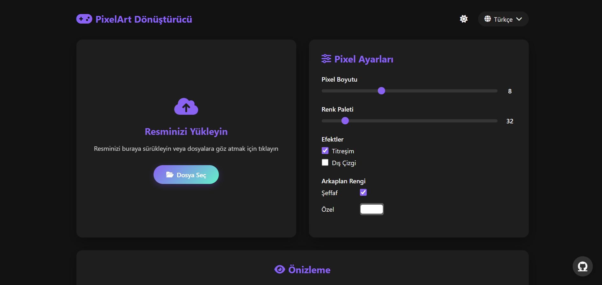

# 🎨 PixelArt Converter

**PixelArt Converter**, herhangi bir görseli pixel art'a dönüştürmenizi sağlayan kullanıcı dostu bir web uygulamasıdır. Oyun geliştiricileri, dijital sanatçılar ve pixel art meraklıları için ideal bir araçtır.



## ✨ Özellikler

- 🖼️ Kolay resim yükleme (sürükle-bırak veya dosya seçme)
- ⚙️ Gelişmiş pixel ayarları:
  - Pixel boyutu ayarı (2-20px)
  - Renk paleti sınırlama (2-256 renk)
  - Dithering efekti
  - Dış çizgi efekti
  - Şeffaf veya özel arkaplan rengi
- 🌍 Çoklu dil desteği (İngilizce, Almanca, Türkçe)
- 🌙 Karanlık/Aydınlık tema seçeneği
- 📥 Pixel art sonucunu indirme
- 🔄 Kolay sıfırlama seçeneği

## 🚀 Kullanım

1. Resminizi yükleyin (sürükle-bırak veya "Dosya Seç" butonuna tıklayın)
2. Pixel ayarlarını istediğiniz gibi düzenleyin
3. Sonucu önizleyin
4. "İndir" butonuna tıklayarak pixel art'ınızı kaydedin

## 🛠️ Teknolojiler

- HTML5, CSS3, JavaScript
- Canvas API for image processing
- Font Awesome ikonları
- Responsive tasarım

## 🌐 Canlı Demo

[PixelArt Converter'ı deneyin]()

## 📦 Kurulum

Projeyi yerel olarak çalıştırmak için:

1. Bu repoyu klonlayın:
   ```bash
   git clone https://github.com/LWEAXO/PixelArt-Converter.git
   ```
2. Klasöre gidin:
   ```bash
   cd PixelArt-Converter
   ```
3. `index.html` dosyasını tarayıcınızda açın

## 🤖 Geliştirici

- **LWEAXO** - [GitHub](https://github.com/LWEAXO)

## 📜 Lisans

Bu proje MIT lisansı altında lisanslanmıştır - detaylar için [LICENSE](LICENSE) dosyasına bakın.

---